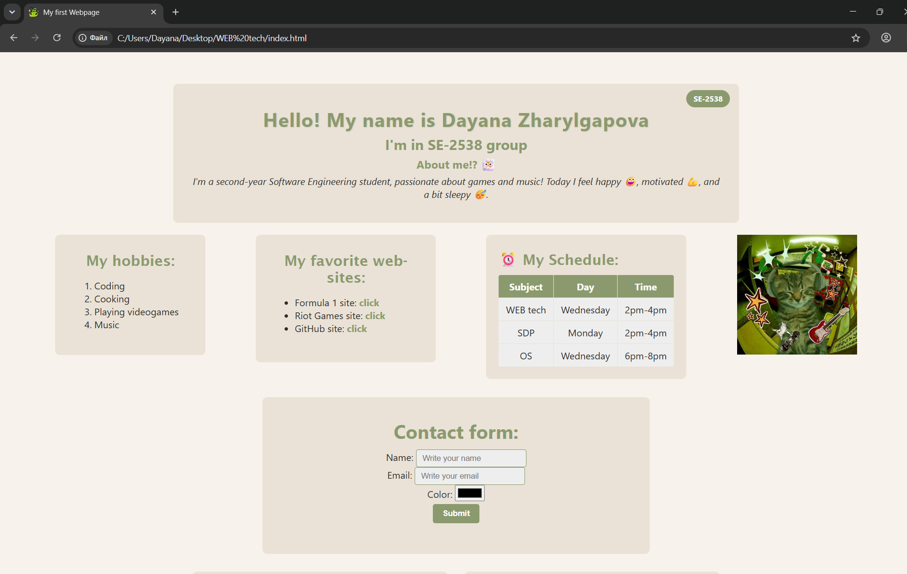
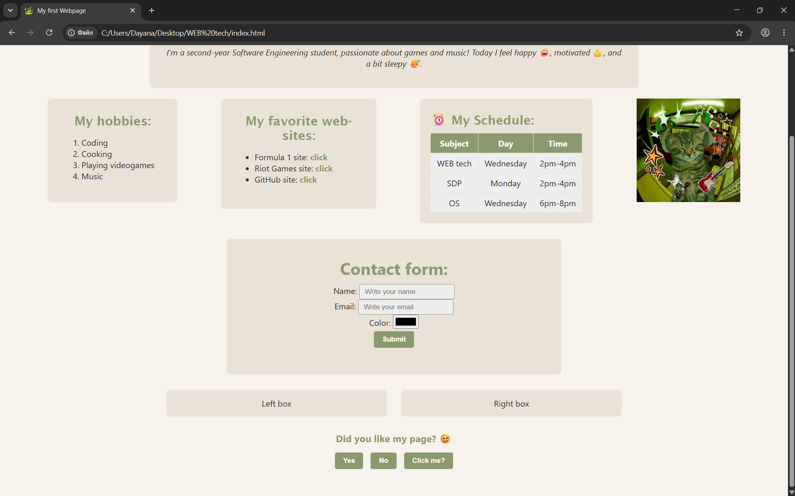

# My First Webpage

## Objective
Create a webpage using HTML and CSS, covering basic and intermediate concepts — from semantic markup and forms to layout techniques like positioning and float.

## Steps Taken

1. **Created the HTML boilerplate.**
   Added `<!DOCTYPE html>`, `<html>`, `<head>`, and `<body>` tags. Set the page title to "My First Webpage" and linked the external stylesheet and favicon.

2. **Structured the content with semantic tags.**
   Added `<h1>`–`<h3>` headings for my name, group, and "About Me" section, plus a short paragraph describing myself with emojis.

3. **Built lists for hobbies and favorite websites.**
   Used an ordered list `<ol>` for hobbies and an unordered list `<ul>` for favorite sites, with clickable `<a>` links inside.

4. **Inserted an image and interactive buttons.**
   Added a personal photo via `` and a few `<button>` elements at the bottom of the page.

5. **Created a schedule table.**
   Built a 3-column table (`Subject`, `Day`, `Time`) and filled it with my weekly class schedule.

6. **Added a contact form.**
   Created a `<form>` with text, email, and color inputs, plus a submit button.

7. **Applied inline CSS.**
   Styled one paragraph directly with the `style` attribute (italic font).

8. **Applied internal CSS.**
   Used a `<style>` block inside `<head>` to set the body background color.

9. **Applied external CSS.**
   Moved the rest of the styling into `style.css` and linked it via `<link rel="stylesheet">`.

10. **Used different CSS selectors.**
    Applied **element selectors** (`body`, `a`, `table`), **class selectors** (`.head`, `.cards`, `.highlight`, `.btn`), and **ID selectors** (`#main-heading`, `#schedule`, `#button`) to demonstrate the difference.

11. **Styled the box model.**
    Experimented with `margin`, `padding`, and `border-radius` on cards, the header block, and the footer form.

12. **Added positioning.**
    Used `position: relative` on the header, `position: absolute` for the badge in the corner, and left the main content block with the default `static` position.

13. **Demonstrated float and clear.**
    Created a two-column layout using `float: left` / `float: right`, and fixed overlap with a `clear: both` element.

14. **Used different sizing units.**
    Applied `px` for borders and small spacing, `%` for widths, `em` for padding, and `rem` for the main heading font size.

15. **Added a favicon.**
    Linked a small icon to the browser tab using `<link rel="icon">`.

16. **Organized the layout with divs.**
    Grouped content into logical sections: `.head`, `.main-content`, `.footer-card`, and `#button`.

## Screenshots

## Reflection
I learned how to structure a webpage with semantic HTML, separate content from presentation using external CSS, and apply core layout techniques like the box model, positioning, and float. I also got more comfortable reading documentation and debugging small CSS issues on my own.

## Link
https://github.com/Tokisao/my-webpage

## Link
https://github.com/Tokisao/my-webpage
